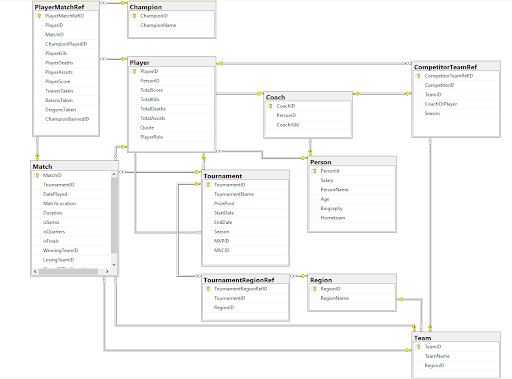
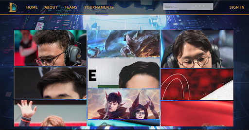
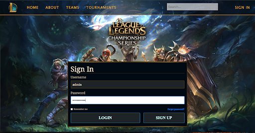
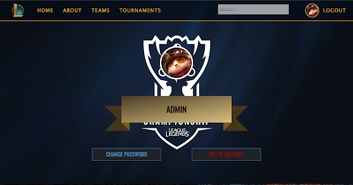
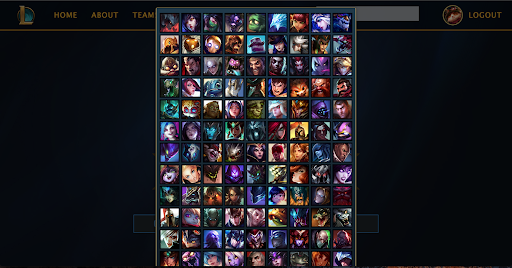
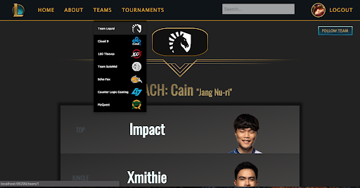

Unfortunately a while back I had to take down the deployment on Azure, however I did find some photos from the presentation my team had to do a while back.

##Database Structure: 
> We used MSSQL and SSDT to manage our database.

##Home Page: 
> Created a masonry effect using bootstrap.

##Sign-in Page: 
> This is where users/admins would log in to manage their account.

##Profile: 
> Users could follow their favorite teams and keep up to date with tournaments involving those teams.

##Avatar: 
> Users could select their avatar among champions.

##Team: 
> You could view teams and what players were on each team. You could also view each player individually but I couldn't find an image of that ;(

##Tournmanent: 
> You could view tournmanets which were part of regions. If you scrolled down you could view the records of each team competing in that tournmanent and even view match history of individual games. Again .pngs not found, but the code's there!
